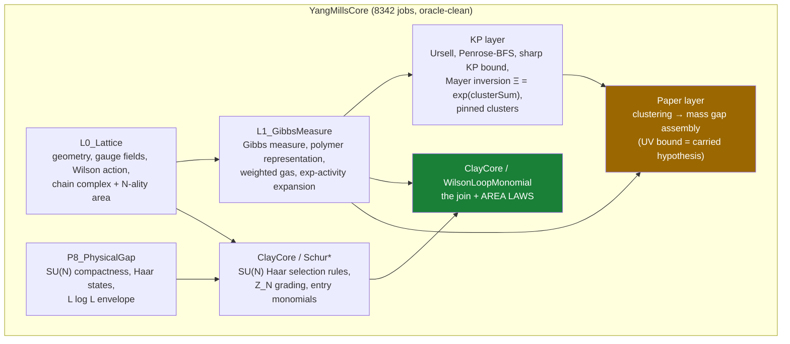

# The Eriksson Programme

**A Lean 4 / Mathlib formalization toward the Yang–Mills mass gap — with honest goalposts.**


-success)


-lightgrey)


This repository contains a **sound, self-contained, machine-verified core** of
lattice Yang–Mills mathematics (`YangMillsCore`: SU(N) Haar selection rules, a
Kotecký–Preiss cluster-expansion layer, an unconditional IR clustering bound, and
a **volume-uniform Wilson-loop area law** for the true Wilson Boltzmann factor) —
together with an explicit, adversarially-audited account of what is **not**
proved. The defining principle is **honesty over progress**: a smaller true
claim always beats a larger hollow one.

```bash
lake build YangMillsCore          # the verified core — green, 8342 jobs
lake env lean oracle_check.lean   # prints the axiom oracle for every headline
```

Every headline result depends on exactly `[propext, Classical.choice, Quot.sound]`
— Lean's three standard axioms. **No `sorry`. No project axioms.** Gaps are
carried as explicit theorem *hypotheses*, never assumed silently.

---

## Progress Dashboard

**Documentation snapshot updated:** 2026-06-23.  **Latest public checkpoint:**
see [`docs/VERIFICATION-LEDGER.md`](docs/VERIFICATION-LEDGER.md).  The latest
recorded core build in the verification ledger is `lake build YangMillsCore`
green at **8342 jobs**.

The bars below are communication estimates for humans, not theorem
probabilities.  The formal record remains the compiler, `oracle_check.lean`,
and [`docs/VERIFICATION-LEDGER.md`](docs/VERIFICATION-LEDGER.md).

### At a glance

| Track | Bar | Reading |
|---|---:|---|
| Verified core integrity | `100% [##########]` | no `sorry`, no project axioms, standard Lean axioms only |
| Reproducible Lean/Mathlib setup | `100% [##########]` | pinned Lean `v4.29.0-rc6` and pinned Mathlib commit |
| KP / Mayer cluster-expansion engine | `100% [##########]` | partition identities, Ursell, Penrose/BFS, sharp KP, pinned tails |
| Strong-coupling Wilson-loop area laws | `100% [##########]` | finite-volume and volume-uniform, linearized and exact-activity |
| Exponential IR clustering | `100% [##########]` | theorem-fed lattice Gibbs clustering with a non-empty window |
| Conditional M3 lattice mass-gap assembly | `90% [#########.]` | the assembly exists; the UV producer remains a named hypothesis |
| Appendix-F / H# bridge to UV consumer | `78% [########..]` | source-facing wrappers, second-gas adapters, half-budget endpoints |
| P4 physical-operator vertical slice | `66% [#######...]` | physical cochains, gauge-fixed covariance, fixed-volume flat Hodge/Poincare closure, flat covariance adapters, and source-facing covariance/root localization APIs are in Lean |
| Concrete YM activity decay `hRpoly` | `40% [####......]` | many adapters are verified; the real Balaban/Dimock estimate is open |
| Peter-Weyl / character infrastructure | `58% [######....]` | generic Schur API and finite character algebra; compact Peter-Weyl completeness is still absent |
| Continuum construction / Clay | `0% [..........]` | no continuum limit, no OS/Wightman reconstruction, no continuum mass gap |

### Human estimates

| Estimate | Bar | Honest translation |
|---|---:|---|
| Infrastructure useful toward M3/Clay | `84% [########..]` | strong lattice-M3 infrastructure; Clay itself is still essentially untouched |
| Unconditional M3 lattice gap | `72% [#######...]` | close in architecture, blocked by the concrete `hRpoly` proof |
| Strict unconditional Yang-Mills Clay | `0% [..........]` | **~0% (<0.1%)** until continuum construction and reconstruction exist |
| Complete formal roadmap toward Clay | `60% [######....]` | the dependency map is serious; the hardest continuum nodes are open mathematics |
| Repository readability for a new human | `82% [########..]` | the project now has a front door, a live state, and an auditable ledger |

### What is actually 100%

* `YangMillsCore` is the public verified root.
* The project has zero `sorry` in Lean source and zero project axioms in the
  verified-core tree, as enforced by `scripts/check_consistency.py`.
* The strong-coupling lattice package is theorem-fed: KP/Mayer, exponential
  clustering, and Wilson-loop area laws.
* The finite and volume-uniform area-law programme is complete in the four
  advertised variants: finite-volume/volume-uniform times linearized/exact.
* The IR side of the lattice mass-gap assembly is no longer a carried input.

### What is not 100%

* `hRpoly` is still the live mathematical frontier: the concrete Yang-Mills
  cluster-expansion-with-holes activity-decay estimate for the actual gauge RG
  operator.
* The P4 material now includes deterministic gauge-fixed precision
  composition, exact covariance from strict coercivity, full-periodic physical
  cochains, a fixed-volume flat Hodge/block Poincare closure, flat physical
  precision/covariance adapters, source-facing covariance/root localization
  APIs, and the finite-torus curl/divergence classification.  It still does
  not construct the physical Yang-Mills Hessian or prove covariance/root
  decay.
* The Appendix-F/H# material is a verified consumer/adapter layer.  It does not
  by itself prove the Balaban/Dimock source theorem.
* Peter-Weyl completeness for compact groups is still not supplied here.
* The Clay problem is not proved, approached, or claimed in the continuum
  sense.  Distance remains **~0% (<0.1%)**.

### Phase estimates

| Phase | Estimate | Current state |
|---|---:|---|
| M0: sound SU(N) Haar/lattice core | `100% [##########]` | done and imported by `YangMillsCore` |
| M1: representation/character layer | `58% [######....]` | strong Schur/character infrastructure; Peter-Weyl completeness open |
| M2: U(1) / toy non-vacuous gap route | `25% [###.......]` | useful foundations exist; not the live frontier |
| M3: SU(N) unconditional lattice mass gap | `72% [#######...]` | IR and assembly done; UV activity producer open |
| M4: continuum limit | `0% [..........]` | open mathematics |
| M5: full Clay statement | `0% [..........]` | open mathematics |

### Latest movement

The latest 2026-06-23 checkpoint did not change the Clay boundary.  It improved
the RG/P4/Appendix-F interface:

* scalar Schur-Catalan and operator-norm coercivity budgets;
* gauge-precision coercivity from a block Poincare/Hodge hypothesis;
* gauge-fixed precision coercivity under summable operator budgets;
* exact finite-dimensional covariance from strict coercivity;
* physical gauge cochains and the physical gauge-operator interface;
* fixed-volume flat Hodge/block Poincare from a classified harmonic kernel;
* one-dimensional flat harmonic classification;
* finite-torus curl/divergence classification;
* integrated second-gas KP adapters and source-bound routes;
* a rooted leaf-summation half-budget endpoint;
* finite target-card tilt in Appendix-F cover weights.

The practical effect is cleaner wiring from future source theorems into the
existing UV consumer.  The remaining work is still the real source-grounded
Yang-Mills activity-decay proof, not another cosmetic wrapper.

---

## Headline results (all oracle-clean, all in the core)

### 0. The volume-uniform area law — *the current flagship*

For the **normalized** Wilson-loop expectation at conjugate-pair linearized
activities (the physical `Re tr` weight, ‖c<sub>p</sub>‖ ≤ δ) in an explicit
strong-coupling window, and any rate σ ∈ [0,1] with (16d+1)²σ < 1 and
2δN<sub>c</sub>·e<sup>16d·K</sup> ≤ σ²:

$$\Bigl\lVert \frac{\int \mathrm{tr}(W_C)\cdot\prod_p (1+f_p)}{Z} \Bigr\rVert \;\le\; N_c \cdot e^{|\mathrm{loopSupp}|\cdot 4d\cdot K} \cdot \sigma^{\mathrm{Area}(C)} \cdot e^{|\mathrm{loopSupp}|\cdot 4d\cdot S(\sigma)}$$

`theorem normalized_wilson_loop_area_law` — [`YangMills/L1_GibbsMeasure/RestrictedGate.lean`](YangMills/L1_GibbsMeasure/RestrictedGate.lean)

**Every constant is volume-free** — area-law decay with a perimeter-only
prefactor, uniformly over all finite lattices. The partition function is
cancelled through a fully formalized volume-restricted cluster expansion
(loop-tagged factorization, restricted Mayer inversion, Z-ratio bounds, pinned
gas resummation — [`docs/AREA-LAW-VU-PLAN.md`](docs/AREA-LAW-VU-PLAN.md), all
bricks closed). The hypothesis window is non-empty (ledger Addendum 17t), and
the integrability inputs are theorems, not hypotheses
(`normalized_wilson_loop_area_law_unconditional`, Addendum 17u): every
remaining hypothesis is an explicit smallness or geometry condition.

The **exact-activity** version `normalized_exp_wilson_loop_area_law`
([`RestrictedGate.lean`](YangMills/L1_GibbsMeasure/RestrictedGate.lean), ledger
Addenda 18–18d) extends the same volume-uniform bound to the **true Wilson
Boltzmann factor** ∏<sub>p</sub> exp(z<sub>p</sub>) — area decay σ<sup>Area(C)</sup>
with a perimeter-only prefactor and rate (e<sup>2δN<sub>c</sub></sup>−1), again with
no integrability hypotheses. Because the volume-restricted cluster machinery is
activity-agnostic, the exact version is the linearized proof with the single
substitution 2δN<sub>c</sub> → e<sup>2δN<sub>c</sub></sup>−1. **The area-law
programme is thus complete in all four variants** (finite-volume and
volume-uniform, each linearized and exact).

A reusable repackaging `area_law_to_exp_area_decay` turns either headline into
**manifest exponential area decay** N<sub>c</sub>·e<sup>−τ·Area(C)</sup> with a
strictly positive string tension τ = (−log σ) − λ, on any loop family whose
perimeter charge is area-subdominant — making the confinement physics explicit.
Its non-vacuity is itself machine-checked
(`area_law_to_exp_area_decay_window_nonempty`: an explicit witness with positive
tension log 2 − ½, ledger Addendum 20).

### 1. The exact-activity Wilson-loop area law

For SU(N<sub>c</sub>) lattice gauge theory with the **true Wilson Boltzmann
factor** ∏<sub>p</sub> exp(z<sub>p</sub>), where
z<sub>p</sub> = c<sub>p</sub>·tr H<sub>p</sub> + c′<sub>p</sub>·conj tr H<sub>p</sub>
and ‖c<sub>p</sub>‖, ‖c′<sub>p</sub>‖ ≤ δ — with **no smallness hypothesis** (any δ ≥ 0):

$$\Bigl\lVert \int \mathrm{tr}(W_C)\cdot\prod_p e^{z_p}\, d\mu_{\mathrm{Haar}} \Bigr\rVert \;\le\; N_c \cdot 2^{|P|} \cdot \bigl(e^{2\delta N_c}-1\bigr)^{\mathrm{Area}(C)} \cdot e^{2\delta N_c\,|P|}$$

`theorem finite_volume_area_law_exp` — [`YangMills/ClayCore/WilsonLoopMonomial.lean`](YangMills/ClayCore/WilsonLoopMonomial.lean)

Here `Area(C)` is the **N-ality area** — the minimal number of plaquettes any
ℤ/N<sub>c</sub> 2-chain needs to span the loop `C`, built from a formalized
lattice chain complex ([`L0_Lattice/ChainComplex.lean`](YangMills/L0_Lattice/ChainComplex.lean)).
At Wilson coupling (2δN<sub>c</sub> = β) the bound decays exponentially in the
area for β < ln 2. Non-vacuity is itself a theorem: concrete plaquette loops
have `Area ≥ 1` (`one_le_chainAreaA_plaquette`). The linearized-activity
versions `finite_volume_area_law` / `finite_volume_area_law_re` (the physical
`Re tr` observable) bound the same integral by `N_c·2^{#P}·(2δN_c)^{Area}`.

*Honest caveat:* the constant here is finite-volume (`2^{#P}`); the
volume-uniform refinement — for both this exact factor and the linearized one —
is result 0 above (now closed).

### 2. The unconditional IR clustering bound

`theorem gibbs_truncated_correlation_bound` — exponential decay of truncated
plaquette correlations for the lattice Gibbs measure at strong coupling, with an
explicit non-empty coupling window (`clustering_window_nonempty`), proved end to
end through the weighted-gas covariance identity and the pinned-cluster
Kotecký–Preiss bound. The SU(N)-specific form is
`sun_two_plaquette_correlator_bound` ([`TwoPlaquetteCorrelator.lean`](YangMills/L1_GibbsMeasure/TwoPlaquetteCorrelator.lean)),
proved **without Peter–Weyl**.

### 3. The conditional lattice mass gap (M3 assembly)

`theorem lattice_mass_gap_of_exp_clustering_uniform`
([`Paper/ClusteringToGap.lean`](YangMills/Paper/ClusteringToGap.lean)) assembles
the lattice mass gap from (i) an IR clustering bound — **now theorem-fed** by
result 2 — and (ii) the §6.3 Balaban single-scale UV bound, which is the
**sole remaining carried hypothesis** of the whole assembly. It is a named
hypothesis of a theorem, never an axiom. See
[`HYPOTHESIS_FRONTIER.md`](HYPOTHESIS_FRONTIER.md).

`theorem lattice_mass_gap_of_per_scale_uv` (same file, ledger Addendum 19)
sharpens that carried hypothesis to the renormalization-group level: the UV
covariance is the finite sum of per-scale RG remainders, and a **single
geometric per-scale contraction** |R<sub>t,k</sub>| ≤ (C₂·e<sup>−c₀t</sup>)·rᵏ —
exactly the form Balaban's Lemma 6.2 supplies — already yields the mass gap, via
the proved §6.3 summation mechanism (`uv_geometric_summation`).

The gauge-RG branch then refines the UV obligation into a source-grounded,
oracle-clean conditional. `lattice_mass_gap_of_cluster_and_coupling`
([`YangMills/RG/UVMassGap.lean`](YangMills/RG/UVMassGap.lean), ledger
Addendum 52) handles the geometric-profile version; the later marginal-coupling
branch (`YangMills/RG/MarginalUVMassGap.lean`, Addenda 62–65) records the honest
4D correction: the Yang-Mills coupling is marginal/asymptotically free, so the
scale profile is summable rather than geometrically decaying. Around this sit
the verified RG substrates in `YangMills/RG/**`: block-spin geometry, the
averaging operator with gauge covariance and explicit l²-contraction,
near-identity logarithm estimates, Gaussian pushforward and finite-dimensional
Gaussian construction, exponential-decay kernel calculus, Schur bounds, PSD
kernel interface, animal counting, cube summability, and shell-growth
summability.

**Honest caveat.** The §6.3 branch is still conditional on the concrete
Yang-Mills **activity-decay** input `hRpoly`: the Dimock/Balaban cluster
expansion with holes plus the fluctuation-integral estimate for the actual
gauge RG operator. The scaffolding around that input is theorem-fed; the
model-specific constructive-QFT estimate is genuine, months-scale mathematics
with no Mathlib primitive. None of this is a continuum result; the Clay
distance is unchanged at ~0%.

### 4. The cluster-expansion layer

The Mayer–Ursell inversion `Ξ = exp(clusterSum)`
(`partition_eq_exp_clusterSum`, [`KP/MayerInversion.lean`](YangMills/KP/MayerInversion.lean)),
the `Z = Ξ` polymer reconstruction, a sharp Kotecký–Preiss convergence bound
with BFS-Penrose tree counting, and pinned-cluster tails — the reusable
constructive-QFT engine behind results 2 and (planned) the volume-uniform area law.

### 5. The SU(N) Haar selection-rule programme

The ℤ<sub>N</sub> grading of Haar integration, Peter–Weyl-free, from characters
up to matrix coefficients: ∫ tr U = 0, ∫ (tr U)<sup>a</sup>(conj tr U)<sup>b</sup> = 0
for N ∤ (a−b), the decorated-entry monomial kill, ∫ |tr U|² ≤ N
([`ClayCore/Schur*.lean`](YangMills/ClayCore)). These are the algebraic engine
of the area law's "kill" mechanism.

The complete machine-checked record — verbatim oracle outputs for every result
above, thirty-plus addenda — is [`docs/VERIFICATION-LEDGER.md`](docs/VERIFICATION-LEDGER.md).

---

## What is **not** proved (read this before citing anything)

* **No continuum limit, no OS/Wightman reconstruction, no continuum mass gap.**
  These are the Clay problem's actual content and they are open mathematics.
  Distance to the Clay prize: **~0% (<0.1%)** — and every status document in
  this repo is required to say so.
* **The §6.3 Balaban UV single-scale bound is a carried hypothesis** of the M3
  assembly (deliberately: it is real mathematics that we have not formalized,
  so it appears as a theorem hypothesis, not an axiom).
* Everything proved is **lattice, strong-coupling
  (Osterwalder–Seiler regime)** — the regime where confinement is classical
  physics lore; the achievement here is the *machine-checked* mathematics, not
  new physics.

<details>
<summary><b>Legacy disclaimer: the vacuous theorem this repo once advertised</b></summary>

An earlier era of this repository exposed a terminal theorem
`clay_millennium_yangMills : ∃ m_phys : ℝ, 0 < m_phys` — which is **vacuous**
(closed by `⟨1, one_pos⟩`; nothing about gauge theory is needed). The 2026-05-29
cleanup ([`CLEANUP_PLAN.md`](CLEANUP_PLAN.md), [`FOUNDATIONS.md`](FOUNDATIONS.md))
carved the sound core out of that sprawl: `YangMillsCore`'s import closure
contains **none** of the vacuous-target chain, none of the legacy axioms, and
zero `sorry`. The legacy status documents are archived in
[`docs/legacy/`](docs/legacy/) as a historical record of what over-claiming
looks like and how it was corrected. The legacy Lean modules still present in
the tree outside the core are scheduled for staged removal and are **not**
part of any claim this README makes.

</details>

---

## Architecture



Green: unconditional flagship. Amber: conditional on the named UV hypothesis.

---

## Build & verify

| Step | Command | Expected |
|---|---|---|
| Toolchain | `elan` picks up [`lean-toolchain`](lean-toolchain) | `leanprover/lean4:v4.29.0-rc6` |
| Mathlib cache | `lake exe cache get` | downloads the pinned-commit `.olean` cache |
| Build the core | `lake build YangMillsCore` | `Build completed successfully (8342 jobs)` |
| Axiom oracle | `lake env lean oracle_check.lean` | every line ends `[propext, Classical.choice, Quot.sound]` |
| Sorry scan | `python scripts/check_consistency.py` | `0` forbidden tokens |

The default `lake build` target (`YangMills.lean`) is just an alias for the core.
**Mathlib is pinned to an exact commit** (lakefile + manifest agree), so the
verified state rebuilds exactly — see [`REPRODUCIBILITY.md`](REPRODUCIBILITY.md).

---

## Documentation map

| Document | What it is |
|---|---|
| [`docs/VERIFICATION-LEDGER.md`](docs/VERIFICATION-LEDGER.md) | **The record.** Verbatim oracle outputs for every headline, 268 addenda. Start here to check any claim. |
| [`HYPOTHESIS_FRONTIER.md`](HYPOTHESIS_FRONTIER.md) | The carried hypotheses, audited. Currently exactly one (§6.3 UV), now sharpened to a per-scale RG contraction. |
| [`FOUNDATIONS.md`](FOUNDATIONS.md) | What "proved" means here; the vacuity audit doctrine. |
| [`CLEANUP_PLAN.md`](CLEANUP_PLAN.md) | How the sound core was carved out of the legacy sprawl. |
| [`HORIZON.md`](HORIZON.md) | The formal dependency DAG to a real mass gap, as fill-in-the-blank Lean signatures. |
| [`ROADMAP.md`](ROADMAP.md) | The measurable plan, written against reality rather than a vacuous target. |
| [`docs/AREA-LAW-PLAN.md`](docs/AREA-LAW-PLAN.md) · [`AREA-LAW-EXACT-PLAN.md`](docs/AREA-LAW-EXACT-PLAN.md) · [`AREA-LAW-VU-PLAN.md`](docs/AREA-LAW-VU-PLAN.md) | The area-law campaigns — all **complete**: linearized, exact-activity, and volume-uniform (V0–V4 closed, both linearized and exact). |
| [`REPRODUCIBILITY.md`](REPRODUCIBILITY.md) | How to rebuild the exact verified state (pinned Mathlib commit) and re-run the oracle checks. |
| [`CURRENT-STATE.md`](CURRENT-STATE.md) | The short live checkpoint: current build, proved substrate, and the exact remaining frontier. |
| [`docs/BALABAN-RG-PLAN.md`](docs/BALABAN-RG-PLAN.md) · [`UV-S2-GAUSSIAN-PLAN.md`](docs/UV-S2-GAUSSIAN-PLAN.md) · [`UV-U1-SMALL-FIELD-PLAN.md`](docs/UV-U1-SMALL-FIELD-PLAN.md) · [`BALABAN-SOURCE-BOUNDS.md`](docs/BALABAN-SOURCE-BOUNDS.md) | The **gauge-RG continuum-facing track** (`YangMills/RG/**`): the averaging/Gaussian/kernel/animal-count substrate and the faithful Balaban/Dimock source bounds; the open input is the concrete YM activity-decay bound `hRpoly`. |
| [`docs/PHYSICAL-OPERATOR-VERTICAL-SLICE.md`](docs/PHYSICAL-OPERATOR-VERTICAL-SLICE.md) | The P4 physical-operator route from Wilson action to covariance to localized activities. First deterministic bricks are closed; the physical Hessian/source estimates remain open. |
| [`docs/UV-SINGLE-SCALE-PLAN.md`](docs/UV-SINGLE-SCALE-PLAN.md) | The §6.3 UV-bound campaign. The logical/summability/coupling scaffolding is oracle-clean; the remaining months-scale work is the model-specific cluster-expansion-with-holes activity estimate. |
| [`docs/SHARP-KP-PLAN.md`](docs/SHARP-KP-PLAN.md) · [`kp-cluster-expansion-plan.md`](docs/kp-cluster-expansion-plan.md) · [`CLUSTER-CORRELATION-PLAN.md`](docs/CLUSTER-CORRELATION-PLAN.md) | The cluster-expansion campaigns (complete). |
| [`PETER_WEYL_ROADMAP.md`](PETER_WEYL_ROADMAP.md) | The standalone Peter–Weyl formalization plan (off the critical path). |
| [`docs/legacy/`](docs/legacy/) | Pre-cleanup era, kept as history. Nothing in it is current. |

**For AI agents:** [`CLAUDE.md`](CLAUDE.md) (hard rules, build mechanics) →
[`README-FOR-NEXT-MODEL.md`](README-FOR-NEXT-MODEL.md) (the live frontier) →
[`AGENT-ONBOARDING.md`](AGENT-ONBOARDING.md) (full brief).

---

## Method

The project advances in **campaigns**: a design document with a brick ladder
(`docs/*-PLAN.md`), one brick proved per session, every brick oracle-checked
before the next, the ledger updated at every green checkpoint. Hard-won
Lean/Mathlib engineering notes (heartbeat hangs, elaboration-order traps,
instance seams) are recorded in the plan of the campaign that hit them, so they
are never paid for twice.

## License

GNU Affero General Public License v3.0 — see [`LICENSE`](LICENSE). © 2026 Lluis Eriksson.
