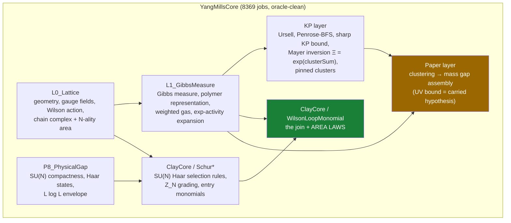

# The Eriksson Programme

**A Lean 4 / Mathlib formalization toward the Yang–Mills mass gap — with honest goalposts.**


-success)


-lightgrey)


This repository contains a **sound, self-contained, machine-verified core** of
lattice Yang–Mills mathematics (`YangMillsCore`: SU(N) Haar selection rules, a
Kotecký–Preiss cluster-expansion layer, an unconditional IR clustering bound, and
a **volume-uniform Wilson-loop area law** for the true Wilson Boltzmann factor) —
together with an explicit, adversarially-audited account of what is **not**
proved. The defining principle is **honesty over progress**: a smaller true
claim always beats a larger hollow one.

```bash
lake build YangMillsCore          # the verified core — green, 8369 jobs
lake env lean oracle_check.lean   # prints the axiom oracle for every headline
```

Every headline result depends on exactly `[propext, Classical.choice, Quot.sound]`
— Lean's three standard axioms. **No `sorry`. No project axioms.** Gaps are
carried as explicit theorem *hypotheses*, never assumed silently.

> **Surface Theorem quarantine — 2026-07-28.**  The endpoint `Y` assembler
> and its full-moment error propagators applied the leading ratio
> `H0/K0=1/(8 cos(t/4))` twice.  The error is an exact missing factor
> `8 cos(t/4)` in values and `8*cmin` in the uniform error charge, not a
> rounding issue.  All K2 endpoint and regular-extension evidence is
> superseded pending
> regeneration.  The positive-delta order-eight S1/S2 campaign is
> independent and continues.  The claimed complete Surface Theorem paper is
> `DO_NOT_SUBMIT` until the corrected endpoint and final-seal audits pass.
> See
> [`INCIDENT-DELTA0-Y-DOUBLE-NORMALIZATION-20260728.md`](docs/INCIDENT-DELTA0-Y-DOUBLE-NORMALIZATION-20260728.md).
>
> **Post-incident K2 progress.**  The degree-eight fixed-square polynomial
> surrogate now has reproduced pointwise complex geometry at
> `rho=17/2000` and a reproduced Rouché certificate for its integrated KD:
> `|KD(0)|>=2.04813729` while
> `max_|delta|=rho |KD(delta)-KD(0)|<=1.01556829`.  Thus that surrogate KD
> is zero-free in the disk.  This does **not** restore K2: the exact R7/R8
> expression engine was nonterminal, its sparse exact replacement and
> independent numerical corroboration are pending, and the true-companion
> plus exterior real-axis charges remain open.  `DO_NOT_SUBMIT` is unchanged.
> See
> [`SURFACE-K2-R8-KD-ROUCHE-PREREG-20260728.md`](docs/SURFACE-K2-R8-KD-ROUCHE-PREREG-20260728.md)
> and
> [`INCIDENT-R7-R8-EXPRESSION-ENGINE-NONTERMINAL-20260728.md`](docs/INCIDENT-R7-R8-EXPRESSION-ENGINE-NONTERMINAL-20260728.md).
>
> **High-beta relay reorientation (2026-07-28).**  The exact two-stage
> main/mirror/rest identity shows that the `lambda>=3` lane needs only the
> weak uniform premise `X_main >= -1/20`, rather than the superseded sharp
> positivity claim.  The rational relay and its tighter extraction from the
> existing `lambda=3` transcript have passed independent production/replay
> checks.  A division-free covariance certificate for the remaining weak
> premise is preregistered on the full parameter rectangle, but has not yet
> produced a Flint/Arb transcript.  Consequently G2 is not restored and
> `DO_NOT_SUBMIT` is unchanged.  See
> [`SURFACE-HIGH-BETA-WEAK-MAIN-RELAY-PREREG-20260728.md`](docs/SURFACE-HIGH-BETA-WEAK-MAIN-RELAY-PREREG-20260728.md)
> and
> [`SURFACE-K2-WEAK-MAIN-COVARIANCE-PREREG-20260728.md`](docs/SURFACE-K2-WEAK-MAIN-COVARIANCE-PREREG-20260728.md).

**Independent O-lane submission (owner report, 2026-07-28).**  Version 1.3 of
*From the Gibbs Weight to the Spectral Gap: A Complete Machine-Checked
Osterwalder-Seiler Chain for the Z_2 Lattice Gauge Chain* has been submitted;
the public identifier is pending.  This nine-page paper is a verified
composition for the one-variable-per-slice `Z_2` chain.  It is not evidence
for the Surface Theorem and makes no claim about `SU(N)`, volume uniformity,
the continuum limit, or the Yang--Mills mass gap.  The owner-reported
submission record and local artifact hashes are in
[`O-LANE-SUBMISSION-OS-CHAIN-Z2-20260728.md`](docs/O-LANE-SUBMISSION-OS-CHAIN-Z2-20260728.md).

---

## Progress Dashboard

**Live dashboard:** [lluiseriksson.github.io/THE-ERIKSSON-PROGRAMME/dashboard](https://lluiseriksson.github.io/THE-ERIKSSON-PROGRAMME/dashboard/)
— the public dependency DAG toward the mass gap, with every node marked
proved / partial / open and linked to Lean sources, docs, or the verification
ledger.

**Control-plane documentation refreshed:** 2026-07-11.  **Latest recorded Lean
checkpoint:** 2026-07-04, source commit `0919aa10`.  This is a verified source
checkpoint, not the current repository HEAD: paper, dashboard, and maintenance
commits may advance independently.  The machine-readable canonical snapshot is
[`project-state.json`](project-state.json), with a human summary in
[`docs/PROJECT-STATE.md`](docs/PROJECT-STATE.md).  The verification
ledger now includes the 2026-07-03 Catalan/Schur checkpoints through Addendum
257 and the 2026-07-04 diamagnetic unitary bridge Addendum 258, after the
earlier Addendum 444 and date-stamped Eq231 material.  The latest recorded full
core build remains
`lake build YangMillsCore` green at **8369 jobs**.

The formal record remains the compiler, `oracle_check.lean`, the verification
ledger, and the canonical snapshot above.  The active Surface Theorem paper is
a separate Part I workstream governed by `CLAUDE.md`; it is not evidence for the
Part II Lean milestones listed here.  Its T1 node-partition instrument was quarantined
under [`INC-T1-ZERO-SCAN`](docs/incidents/INC-T1-ZERO-SCAN.md) and has now been
repaired; the wider v88 numerical evidence has now passed five independent reruns and
the executable T2--T7 audit.  The closed incident records an instrumental failure, not a
disproof of the theorem.  The separate
[`Surface Theorem closure gates`](docs/SURFACE-CLOSURE-GATES.md) prevent a local
remainder, compact-range certificate, or successful paper build from being mistaken for
the global theorem seal.

**Surface closure checkpoint (2026-07-17).**  The closure board remains
`DO_NOT_SUBMIT`: G0, G3, G4, and G5 are certified; G2 has certified regular
`[0,1/125]` plus the current-head hybrid `[1/125,9/1000]` regular lane, while
the scaled-bulk union and K2/K4 analytic relays remain open.  A fresh grid-24
K2 design probe exhausted its 900-second ceiling without a verdict and is
recorded as a design-cost incident in
[`INC-K2-PHYSICAL-SERIES-DESIGN-FAIL`](docs/incidents/INC-K2-PHYSICAL-SERIES-DESIGN-FAIL.md).
No manuscript slot or theorem claim was promoted by that probe.

For the live G2 work, the exact sixth head is certified and the regular lane
now has a corrected, manifested exact-`r4` certificate on
`[0,1/125] x [0,pi]`.  The earlier unparameterized extensions remain
quarantined by
[`INC-K2-REGULAR-EXTENSION-OUTER-DOMAIN`](docs/incidents/INC-K2-REGULAR-EXTENSION-OUTER-DOMAIN.md):
their outer annulus retained the endpoint-only `delta_max=0.001` contract.
The current rerun passes all 158 boxes with four incremental delta cores,
eight delta-subdivided annuli, physical split `1181/1000`, moving-band radius
`66/5`, a frozen mixed `384/192/384` grid map, and componentwise perturbation.
Its worst strict lower margin is `0.0000111964436952...` at index 50.  The
positive-box stress descendant also passes its independent fixed-domain budget,
while 42 positive delta births `j=8,...,49` remain open
under the repaired two-track jet contract documented by
[`INC-K2-T-CENTER-HYBRID-JET`](docs/incidents/INC-K2-T-CENTER-HYBRID-JET.md).

The new coefficient-tail experiment is recorded in
[`SURFACE-G2-TAIL-RADIUS-PROBE`](docs/SURFACE-G2-TAIL-RADIUS-PROBE.md).  It
reproduces the registered `r7` and `r8` formulas, but its preliminary
coefficient ratios decrease rather than supporting a uniform Cauchy radius
above `1/3`.  This is adverse design evidence only: it adds no theorem load
and leaves `DO_NOT_SUBMIT` unchanged.

**K4 update (2026-07-19).**  A preregistered isolated centred-delta campaign
now covers 39 adjacent positive bands `[0.0305,0.05]` at `t=2.9`: all 78
production/replay transcripts validate, with 89,856 terminal cells and worst
normalized fraction `0.501618819006`.  This is candidate local evidence only.
A separate `t`-design probe on the same band gives fractions up to `3.23e15`
on the born partition away from the stress value, so no global K4 `t`-union is
inferred.  The provenance and negative design record are
[`K4 positive preregistration`](docs/SURFACE-REMAINDER-K4-POSITIVE-0305-0500-PREREG.md),
[`K4 manifest`](run-manifests/surface-remainder-k4-positive-0305-0500-20260719.json),
and [`K4 t-design incident`](docs/incidents/INC-K4-T-DESIGN-ENDPOINT-20260719.md).

A new high-order `CWIN=3/2` unit on `[78+1/8,78+1/4]` is now recorded under
[`SURFACE-SCALED-BULK-CWIN3P2-HIGH-78P125-78P25-PREREG`](docs/SURFACE-SCALED-BULK-CWIN3P2-HIGH-78P125-78P25-PREREG.md):
189 adjacent rows pass with strict negative Arb upper endpoints, and a second
execution reproduces the domain and row count.  It remains candidate-only and
does not alter G2/G6.

**Surface closure live note (2026-07-17).**  The next K2 birth
`delta in [1/125,9/1000]` now passes its complete union validator: 158
resumable, provenance-checked units from current source commit
`8b4a17c0681601d0d433ed769d23ce8daa8269a9`, with worst strict lower margin
`0.0169551281` at `parent_145`.  The current-head rerun is owned by
`run-manifests/surface-remainder-k2-hybrid009-current-20260717T085239Z.json`.
This is only the regular part; the moving-edge complement remains assigned to G5,
and later positive births
through `delta=1/20` remain open.  Independently, the moving
right edge G5 has been reduced exactly to five cancellation-free scaled
families `U0,U1,U2,B0,B1`, with target
`H=P0/(4 B0^2)`.  The two moving saddle charts and their fixed exterior gap
now have an audited analytic design.  Row 63 and its independent Fourier
oracle regression pass.  A clean-process rerun of upper mixed row 74,
however, returned indeterminate `P0` and `H`; the earlier untranscripted
75-row terminal line has therefore been withdrawn.  The replacement G5
production/replay chain is now the authoritative `CERTIFIED` route.
The repair splits `delta in [0,1/125]` into eight exact thousandth boxes,
giving 600 frozen cells.  All 600 design cells and all 600
provenance-bearing production cells pass under commit `1da7e414`; after an
order-only validator incident was registered and repaired, the executable
union validator passes 600/600 with worst strict lower margin
`0.0538267940...` at `(delta_index,lambda_index)=(0,74)`.  The independent
second execution has now reproduced all 600 rows, so the half-line is a
complete independently rerun certificate.  A separate
finite-overlap probe at
`delta in [49/1000,1/20]`, `lambda in [74/50,75/50]` rejects the
uniform-independent-tail architecture (`P0 in +/-0.00552`,
`H in +/-0.648` even on the mixed grid).  Its successor uses local
beta-dependent tails: five exact bands give a 375-cell design cover for
`30<=beta<=125`, and three adjacent bands give a 225-cell design cover for
`25<=beta<=30`.  The compact relocated-splice design reaches beta 25.
Together these are a full G5 design architecture on `beta>20`.  The lower
finite cover is now frozen and independently replayed (225/225 rows exactly);
the upper finite cover is also independently replayed (375/375 rows exactly).
The compact extension is now included in the certified chain.  The complete
half-line production has
now also been independently rerun from source commit `1da7e414`: all 600 rows
are byte-equal after JSON parsing, with the same worst strict lower margin
`0.053826794028...` at cell `(0,74)`.
The two freshly recomputed finite design unions also validate exactly:
225/225 lower cells on `25<=beta<=30`, worst `H` lower
`0.01991954958...` at `(2,74)`, and 375/375 upper cells on
`30<=beta<=125`, worst `0.02589561278...` at `(3,74)`.
An independent Fable-5 static audit found no error in the identities and is
recorded as `PASS_DESIGN_NOT_CERTIFIED`, but its sandbox could not execute the
cover.  The execution incident and stronger-grid repair contract are recorded
in
[`INC-G5-HALFLINE-NONREPRODUCIBLE-DESIGN.md`](docs/incidents/INC-G5-HALFLINE-NONREPRODUCIBLE-DESIGN.md).
See also
[`SURFACE-RIGHT-EDGE-DIVIDED-DIFFERENCE.md`](docs/SURFACE-RIGHT-EDGE-DIVIDED-DIFFERENCE.md),
[`SURFACE-RIGHT-EDGE-FIVE-FAMILY-SCALING.md`](docs/SURFACE-RIGHT-EDGE-FIVE-FAMILY-SCALING.md),
and
[`SURFACE-RIGHT-EDGE-FIVE-FAMILY-TAIL.md`](docs/SURFACE-RIGHT-EDGE-FIVE-FAMILY-TAIL.md).
The independent audit record is
[`SURFACE-RIGHT-EDGE-FIVE-FAMILY-AUDIT.md`](docs/SURFACE-RIGHT-EDGE-FIVE-FAMILY-AUDIT.md).
Neither workstream is a global Surface Theorem seal yet.

For the remaining finite part of G2/G4, an exact scaled bridge has now been
pre-registered before measurement.  Writing
`J_m(beta)=exp(-beta)I_m(beta)` multiplies both Fourier coefficient families by
`exp(-4 beta)` and the Wronskian by the positive factor `exp(-8 beta)`, so the
sign problem is unchanged while the interval magnitudes remain moderate.  The
candidate splice covers `20<=beta<=1000/9` and meets the already certified
regular lane at the exact rational endpoint `1000/9`.  The viable design is
the original moving union: an order-11 scaled bulk ends at
`t=pi-3/(2 beta)` and the independently recomputed G5 cover owns the
complement.  On the stress box `[40,40.1]`, order 11 reduced the bulk cover
from 5,639 to 646 terminal boxes.  A fixed-right optimization was tested and
retired after its remainder judge failed; it carries no evidence.

At the left endpoint the generic Taylor form lost cancellation at the two
high-beta anchors.  An exact paired-moment form through `t^16`, with beta
order 20 and an outward derivative-21 remainder, now passes the four anchors
at beta 20, 40, 80, and 111 while retaining the exact splice `t=19/100`.
Production uses 912 adjacent rational beta intervals and validates every
terminal t interval.  The resulting 4,636 rows pass the production validator
and a fresh independent replay with exact row equality; the global paper seal
remains blocked by the other open relays.
All overlap, scaled derivative-tail, coverage, and splice judges are fixed in
[`SURFACE-FINITE-BETA-BRIDGE-PREREG.md`](docs/SURFACE-FINITE-BETA-BRIDGE-PREREG.md).

**Surface bridge update (2026-07-16).**  The scaled bulk now has separate,
provenance-bearing production/replay candidates through `beta=45`:
`[35,36]`, `[36,37]`, `[37,40]`, `[40,43]`, and the order-16 replacement
`[43,45]`.  Their executable validators reproduce the adjacent unions exactly
(112 beta boxes and 18,668 adaptive `t` boxes in total).  These are candidate
witnesses, not a global G2 certificate: `[45,1000/9)` and the analytic splice
remain open.  An order-12 exploratory continuation at `[43,45]` hit a new
`1/32` adaptive ceiling; raising the beta Taylor order to 16 removes that
local ceiling under the separately preregistered `[43,45]` contract.  The
authoritative submission state remains `DO_NOT_SUBMIT` in
[`SURFACE-CLOSURE-GATES.md`](docs/SURFACE-CLOSURE-GATES.md).

The order-24 continuation `[45,50]` is now complete under its frozen
`CWIN=4`, beta-width-`1/8`, 180-bit contract: 40 production/replay-equal beta
rows and 7,684 adaptive `t`-boxes, with an independent union validator in
green.  This is still candidate evidence only; the adjacent union is not
promoted to G2.  A separate text-level audit of the
archived `[20,25]` and `[25,30]` units is available as
`scripts/audit_surface_scaled_bulk_transcript_rows.py`; it confirms 100
adjacent beta rows and 11,754 replay-equal `t`-boxes, without changing the
`DO_NOT_SUBMIT` state.

The next central unit `[30,31]` now has a frozen `CWIN=4` production/replay
candidate: 10 adjacent beta rows and 2,827 adaptive `t` boxes, with exact row
equality and an independent validator.  A legacy exploratory count of 3,809
used the old `CWIN=3/2` default and is explicitly quarantined in
[`INC-SCALED-BULK-30-31-CWIN-DISCREPANCY.md`](docs/incidents/INC-SCALED-BULK-30-31-CWIN-DISCREPANCY.md).
This local unit does not promote G2 or change `DO_NOT_SUBMIT`.

The next preregistered continuation `[31,35]` has likewise completed its four
production/replay units: 40 adjacent beta rows, 19,019 adaptive `t` boxes,
exact replay equality, and a passing union validator.  It remains candidate
evidence only; the central bridge and its tail contract are still open.

The high-beta continuation `[50,51]` is now also a frozen order-24/order-17
candidate: eight `1/8` units, 2,015 adaptive `t` boxes, exact production/replay
row equality, and a passing union validator.  It remains candidate evidence;
the bridge from `[51,1000/9)` and the global tail audit are still open.

The adjacent `[51,52]` strip now has the same frozen order-24 contract and
passes production/replay and union validation (eight units, 2,237 adaptive
`t` boxes). It remains candidate evidence only; the remaining central bridge
is not promoted.

The continuous candidate campaign `[52,60]` is now complete: 64 frozen
order-24/order-17 units, 28,666 adaptive `t` boxes, exact production/replay
equality, and a passing union validator. It remains local candidate evidence;
the central bridge and tail contract are still open.

Across all available scaled-bulk validators, the candidate strips now account
for 407 adjacent beta boxes and 120,042 adaptive `t` boxes over `[20,67]`.
This is an audit aggregate only: it does not promote G2 or remove the paper's
scaled-bulk slot.

The next frozen sign-row unit `[67,67.25]` now has production and byte-identical
replay: 189 terminal `t` rows, each with a strictly negative Arb upper
endpoint, complete adjacency, and the fixed `beta_order=24`, `t_order=29`,
`CWIN=4` contract.  It remains candidate evidence; the bridge to
`1000/9`, the independent tail splice, and the global relay audit are still
open.  The validator incident involving Arb object equality is recorded in
`INC-SCALED-BULK-67-VALIDATOR-ARB-EQUALITY.md`.

The two-box extension `[67,67.5]` has now been independently produced and
replayed as well: 379 terminal `t` rows, strict negativity on every row, and
exact adjacent coverage.  It remains a candidate strip; no G2 promotion
follows from extending the finite evidence by itself.

The next four-box strip `[68,69]` also passes production and replay: 777
terminal `t` rows with strict Arb negativity and exact per-box adjacency.  It
is candidate evidence only; `[69,1000/9)`, the tail splice, and the global
relay audit remain open.

The frozen campaign has now begun with its first batch `[69,70]`: 4/4 beta
units, 796 terminal `t` rows, independent replay, and a green partial union
validator.  The remaining campaign units are still unrun; this partial batch
does not promote G2.

Within the next batch the parent `[70.75,71]` failed at the frozen quarter
width near the moving edge.  Its preregistered two-half repair passes
production/replay and validation (386 rows total); the failure and repair are
kept explicit, and the subsequent campaign has not been silently widened.

The following two parents, `[71,71.25]` and `[71.25,71.5]`, likewise required
their separately preregistered fixed half-width repairs; both pass replay and
validation (389 and 390 rows respectively).  This growing repair cost is
recorded rather than hidden and confirms that the `CWIN=4` candidate is not
yet a terminal relay.

A direct seam probe with the relay-required `CWIN=3/2` also fails locally at
`beta=[69,69.25]` near `t=3.11444315`; this is recorded in
`INC-SCALED-BULK-CWIN-3P2-LOCAL-FAIL-20260717.md`.  The finite evidence
cannot be promoted merely by changing the moving-edge label.

A separately preregistered narrow-seam probe now repeats the same domain with
four fixed beta descendants of width `1/16`.  Production and replay are
byte-identical and validate 747 strictly negative `t` rows.  This is the
first admissible `CWIN=3/2` candidate witness, archived with
`SURFACE-SCALED-BULK-CWIN3P2-NARROW-PREREG.md` and the
`run_surface_scaled_bulk_cwin3p2_narrow_69_69p25.py` validator.  It remains
strictly local: no part of G2 or G6 is promoted until the full finite-beta
union, scaled-tail splice, and independent relay audit pass.

The immediately adjacent `[69.25,69.5]` extension, pre-registered under the
same fixed width, also passes production/replay.  The eight-unit combined
validator reports 1,496 adjacent strict rows.  This extends the candidate
witness only; it does not change the `DO_NOT_SUBMIT` board.

The next fixed block `[69.5,70]` also passes all eight descendants.  The
sixteen-unit production/replay validator now reports 3,008 strict rows across
`[69,70]`; this remains a finite candidate prefix, not a completed scaled
bridge.

At the conditioning boundary near β=100, a separately pre-registered
high-order unit `[100,100+1/16]` (`beta_order=30`, `t_order=37`) passes
production and replay with 300 strict rows.  Its dedicated validator and
transcript are candidate evidence only; the high-order cost and the remaining
finite-beta union still prevent G2 promotion.

The adjacent pre-registered unit `[100+1/16,100+2/16]` uses the same contract
and independently passes production/replay with 301 strict rows.  Its validator
is `scripts/validate_surface_scaled_bulk_cwin3p2_high_100p0625.py`; this extends
candidate evidence only and does not alter the G2/G6 gates.

The next exact unit `[100+1/8,100+3/16]` also passes production/replay under the
same contract, with 302 strict rows.  The generic validator
`scripts/validate_surface_scaled_bulk_cwin3p2_high_unit.py` checks its rational
domain, dependency hashes, adjacency, and byte-identical replay.  It remains
candidate evidence only.

The adjacent unit `[100+3/16,100+1/4]` passes the same production/replay
protocol with 302 strict rows.  It extends only the candidate archive; G2/G6
remain unchanged until a complete union and relay audit exist.

The high-order `CWIN=3/2` continuation has since been extended by four
preregistered units `[100+13/16,101+1/16]` (1,246 rows total) and four fresh
units `[101+1/16,101+5/16]` (1,262 rows).  All eight production/replay pairs
pass strict validation and exact adjacency.  The paired finite-beta candidate
component is now `[20,101.3125]`, leaving the explicit topology gap
`[101.3125,1000/9]`; the aggregate audit reports 36/36 validators and 53,818
strict rows.  The subsequent four-unit continuation `[101+5/16,101+9/16]`
adds 1,271 strict rows and extends the component to `[20,101.5625]`; the
remaining gap is `[101.5625,1000/9]`.  A single-unit continuation
`[101+9/16,101+5/8]` adds 320 rows with production, independent replay,
strict validation, and manifest
`run-manifests/surface-scaled-bulk-cwin3p2-high-101p5625-101p625-20260720.json`.
The component is now `[20,101.625]`; the remaining gap is `[101.625,1000/9]`
and the aggregate is 55,409 rows.  These
are candidate sign rows only: the sign-to-`(H_tail)` relay
and the final G2/G6 promotion remain open.

The attempted fixed-width `1/8` replacement for the unresolved
`[69,1000/9)` tail was stopped after units `u69_085`--`u69_098` failed near
the right `t` edge.  The fourteen negative transcripts are retained under
`scripts/`; the incident report is
[`INC-SCALED-BULK-UNIFORM-1_8-FAIL-20260717.md`](docs/incidents/INC-SCALED-BULK-UNIFORM-1_8-FAIL-20260717.md).
No replay, manifest, or theorem promotion was made from that route.

The high-order continuation at `[78.25,80]` likewise failed at its registered
minimum `t` width; that negative transcript is retained in
[`INC-SCALED-BULK-CWIN3P2-HIGH-78P25-80-FAIL-20260718.md`](docs/INC-SCALED-BULK-CWIN3P2-HIGH-78P25-80-FAIL-20260718.md).
Narrowing only the beta unit to `[78.25,78.375]` then passed production and
independent replay with 189 strict rows and byte-identical output. It remains
candidate evidence, not a G2/G6 promotion.
The adjacent `[78.375,78.5]` unit now passes the same production/replay
protocol (189 rows); the two-unit archive is still only a candidate seam.
The next `[78.5,78.625]` unit also passes production/replay (190 rows),
extending that seam without changing the gate state.

For K4, a fourth-order centred-`delta` experiment produced finite two-cell
design margins while two direct regular-endpoint realizations failed.  A
combined clean-tree regression then showed that the finite two-cell result
depended on experimental rationalizations of two files that are frozen G5
dependencies: after those files were restored, the 576-cell smoke returned
`nan` in all seven totals.  The finite margins are therefore quarantined as
non-reproducible experiments, not current design evidence.  K4 remains open
pending an isolated regular-ball implementation, a frozen full partition,
production transcripts, and the literal S1''' union judge.  Details and
non-promotion rules are in
[`SURFACE-REMAINDER-K4-DESIGN.md`](docs/SURFACE-REMAINDER-K4-DESIGN.md).
The current isolated endpoint follow-up also passes a frozen two-box
weighted strip, `delta=[0.048,0.05]` at `t=2.9`, with 3,456 adaptive cells
and all seven totals strictly below one.  Its transcript and validator are
`surface_remainder_k4_endpoint_strip_transcript.txt` and
`validate_surface_remainder_k4_endpoint_strip.py`; this remains a local
endpoint witness and does not supply the missing `t` union, low-`z` cover,
or global S1'''/S2''' judge.
The definitive Surface Theorem does not require this optional sharpening:
the preceding mirror estimate `M` is unconditional, and the removed
`M_sharp` subsection explicitly carried no relay load.  An executable paper
audit now enforces that distinction.  K4 remains open research, not a
submission blocker.

The tenth-birth R6 lane has a separate exact-monomial feasibility record:
the 158-box nominal cover has radius `2145.3549728393555`, and an
order-five companion perturbation charge adds only `2.05340511393314865`
under an individual-moment bound. These figures are recorded in
[`SURFACE-REMAINDER-R6-NOMINAL-PROBE.md`](docs/SURFACE-REMAINDER-R6-NOMINAL-PROBE.md)
and remain design-only until fixed completion, outer tails, and the literal
weighted union are closed.

### At a glance

| Track | Status | Reading |
|---|---|---|
| Verified core integrity | **PROVED** | no `sorry`, no project axioms, standard Lean axioms only |
| Reproducible Lean/Mathlib setup | **PINNED** | Lean `v4.29.0-rc6` and a fixed Mathlib commit |
| KP / Mayer cluster-expansion engine | **PROVED** | partition identities, Ursell, Penrose/BFS, sharp KP, pinned tails |
| Strong-coupling Wilson-loop area laws | **PROVED** | finite-volume and volume-uniform, linearized and exact-activity |
| Exponential IR clustering | **PROVED** | theorem-fed lattice Gibbs clustering with a non-empty window |
| M3 lattice mass-gap assembly | **CONDITIONAL** | the assembly exists; the UV producer remains a named hypothesis |
| Appendix-F / H# bridge and P4 operator layer | **PARTIAL** | extensive verified consumers and interfaces exist; the physical source estimates are not proved |
| Concrete YM activity decay `hRpoly` | **OPEN** | this is the live analytic frontier; surrounding scaffolding does not discharge it |
| Peter-Weyl / character infrastructure | **PARTIAL** | generic Schur API and finite character algebra exist; compact Peter-Weyl completeness is absent |
| Continuum construction / Clay | **OPEN** | no continuum limit, no OS/Wightman reconstruction, no continuum mass gap |

No completion percentage is canonical.  In particular, a large amount of
verified infrastructure cannot be converted into a defensible probability or
percentage that the remaining analytic theorem will close.

### What is actually 100%

* `YangMillsCore` is the public verified root.
* The project has zero `sorry` in Lean source and zero project axioms in the
  verified-core tree, as enforced by `scripts/check_consistency.py`.
* The strong-coupling lattice package is theorem-fed: KP/Mayer, exponential
  clustering, and Wilson-loop area laws.
* The finite and volume-uniform area-law programme is complete in the four
  advertised variants: finite-volume/volume-uniform times linearized/exact.
* The IR side of the lattice mass-gap assembly is no longer a carried input.

### What is not 100%

* `hRpoly` is still the live mathematical frontier: the concrete Yang-Mills
  cluster-expansion-with-holes activity-decay estimate for the actual gauge RG
  operator.
* The P4 material now includes deterministic gauge-fixed precision
  composition, exact covariance from strict coercivity, full-periodic physical
  cochains, a fixed-volume flat Hodge/block Poincare closure, flat physical
  precision/covariance adapters, source-facing covariance/root localization
  APIs, a local fluctuation-activity certificate, finite-torus curl/divergence
  classification, physical/CMP116 coordinate dictionaries, localized-root
  transport, dictionary-backed Gaussian/activity construction scaffolding,
  canonical Gaussian integral consumers, a Wilson-Hessian/Green source
  dictionary, definitional Gaussian pushforward closure, raw-source transport
  to Appendix-F,
  the source-facing Balaban CMP116 theorem target, CMP116 Lemma 3 source-boundary
  packaging, Eq. (2.29), Eq. (2.31), Eq. (2.37), and post-`P` residual
  consumers, a resolvent-first local SPD precision substrate, local-SPD root
  frontier packaging, dictionary root-map norm budgets, source-normalized
  Gaussian record routes, finite-piece root sums, and physical activity
  consumers.  It
  still does not construct the physical Yang-Mills Hessian or prove
  covariance/root/activity decay.
* The Appendix-F/H# material is a verified consumer/adapter layer with generic
  and CMP116 support-dependency wrappers through `K#`, evaluated second-gas
  activities, integrated `H#` locality wrappers, raw-source `hraw`/H# and M3
  consumers, source-assumption packaging into the M3 frontier, finite-family
  activity consumers, CMP116 Lemma 3 resummation-source constructors, Eq. (2.31)
  weighted/interior-boundary/positive-tail routes, Eq. (2.37) post-`P`
  operational cards, `Z0` source-budget adapters, a combined post-`P`
  residual source package, an executable M3 frontier graph, source-db
  crosswalks, cluster-union containment facts, source-only UV endpoints,
  finite-size-count bridges, `hRpoly` animal-summability adapters, certified
  Appendix-F tail profiles, source-fed residual estimates, CMP119/CMP122 E/R/B
  decomposition interfaces, CMP119 B/local source-bound and weight-transport
  dictionaries, B/local metric/rate/amplitude/activity dictionary frontiers,
  canonical-root K# summability/smallness discharge, a source-facing
  canonical-root residual H# route, and the Eq. (2.31) `gapCubes` candidate
  definition.  It does not by itself prove the Balaban/Dimock source theorem.
* Peter-Weyl completeness for compact groups is still not supplied here.
* The Clay problem is not proved, approached, or claimed in the continuum
  sense.  Distance remains **~0% (<0.1%)**.

### Phase status

| Phase | Status | Current state |
|---|---|---|
| M0: sound SU(N) Haar/lattice core | **PROVED** | imported by `YangMillsCore` |
| M1: representation/character layer | **PARTIAL** | strong Schur/character infrastructure; Peter-Weyl completeness open |
| M2: U(1) / toy non-vacuous gap route | **PARTIAL** | useful foundations exist; not the live frontier |
| M3: SU(N) unconditional lattice mass gap | **CONDITIONAL** | IR and assembly done; UV activity producer open |
| M4: continuum limit | **OPEN** | open mathematics |
| M5: full Clay statement | **OPEN** | open mathematics |

### Latest movement

The latest 2026-07-04 source checkpoint did not change the Clay boundary.  It
closed several useful finite interfaces while keeping the analytic frontier
explicit:

* PR #4's rooted Catalan closure is integrated into `YangMillsCore`: exact
  child-factorial Catalan identities, plane/labeled tree infrastructure, and
  the finite Catalan majorant partial-sum lane are now theorem-fed;
* `YangMills/KP/ActivityDomain.lean` is now upstreamed into `YangMillsCore`:
  KP activity domination gives a closed zero-free activity polydisc, and the
  fugacity section `w -> Xi(w * z)` is an explicit polynomial;
* `RootedCatalanMajorant.lean` now proves the convolution support,
  antidiagonal flattening, quadratic/reset recursions, and scaled closed
  square-root bound for the repo-local Catalan majorants;
* `SchurCatalanBudget.lean`, `GaugeFixedPrecision.lean`, and
  `PhysicalGaugeOperator.lean` now feed Catalan partial budgets into Schur
  coercivity, block-Poincare coercivity, the physical precision defect, and an
  exact covariance object with inverse identities, PSD, and norm bound;
* the flow-diamagnetic UV route has started as theorem-fed infrastructure:
  marginal-recursion/coupling summability, killed-region walks, finite
  isometry-sum bookkeeping, block-transport coefficient bounds, factorial
  kernel convergence/bound objects, and the finite bridge from complex unitary
  matrices to Euclidean linear isometries now live in `YangMills/RG/MarginalCoupling.lean`,
  `YangMills/RG/Diamagnetic.lean`, and
  [`docs/FLOW-DIAMAGNETIC-PLAN.md`](docs/FLOW-DIAMAGNETIC-PLAN.md);
* `oracle_check.lean` now covers the KP activity-domain theorems, the physical
  precision residual budget, and Appendix-F hole target geometry/family targets;
* `source-db` now routes the physical precision defect blocker, supports token
  fallback search, and links Gaussian-root/activity/Eq229/Eq237 proof-obligation
  cards to their source dictionary fields; the Eq229 Cammarota blocker remains
  explicit;
* the area-law paper artifact is now tracked under `paper/area-law/`;
* the latest recorded full core build is still the 8369-job core build, while
  `origin/main` has advanced to `0919aa10`.

The practical effect is that one more finite combinatorial/RG-budget lane is
closed before the source estimates arrive.  The remaining work is still the
real source-grounded Yang-Mills activity-decay proof, not another cosmetic
wrapper.

---

## Headline results (all oracle-clean, all in the core)

### 0. The volume-uniform area law — *the current flagship*

For the **normalized** Wilson-loop expectation at conjugate-pair linearized
activities (the physical `Re tr` weight, ‖c<sub>p</sub>‖ ≤ δ) in an explicit
strong-coupling window, and any rate σ ∈ [0,1] with (16d+1)²σ < 1 and
2δN<sub>c</sub>·e<sup>16d·K</sup> ≤ σ²:

$$\Bigl\lVert \frac{\int \mathrm{tr}(W_C)\cdot\prod_p (1+f_p)}{Z} \Bigr\rVert \;\le\; N_c \cdot e^{|\mathrm{loopSupp}|\cdot 4d\cdot K} \cdot \sigma^{\mathrm{Area}(C)} \cdot e^{|\mathrm{loopSupp}|\cdot 4d\cdot S(\sigma)}$$

`theorem normalized_wilson_loop_area_law` — [`YangMills/L1_GibbsMeasure/RestrictedGate.lean`](YangMills/L1_GibbsMeasure/RestrictedGate.lean)

**Every constant is volume-free** — area-law decay with a perimeter-only
prefactor, uniformly over all finite lattices. The partition function is
cancelled through a fully formalized volume-restricted cluster expansion
(loop-tagged factorization, restricted Mayer inversion, Z-ratio bounds, pinned
gas resummation — [`docs/AREA-LAW-VU-PLAN.md`](docs/AREA-LAW-VU-PLAN.md), all
bricks closed). The hypothesis window is non-empty (ledger Addendum 17t), and
the integrability inputs are theorems, not hypotheses
(`normalized_wilson_loop_area_law_unconditional`, Addendum 17u): every
remaining hypothesis is an explicit smallness or geometry condition.

The **exact-activity** version `normalized_exp_wilson_loop_area_law`
([`RestrictedGate.lean`](YangMills/L1_GibbsMeasure/RestrictedGate.lean), ledger
Addenda 18–18d) extends the same volume-uniform bound to the **true Wilson
Boltzmann factor** ∏<sub>p</sub> exp(z<sub>p</sub>) — area decay σ<sup>Area(C)</sup>
with a perimeter-only prefactor and rate (e<sup>2δN<sub>c</sub></sup>−1), again with
no integrability hypotheses. Because the volume-restricted cluster machinery is
activity-agnostic, the exact version is the linearized proof with the single
substitution 2δN<sub>c</sub> → e<sup>2δN<sub>c</sub></sup>−1. **The area-law
programme is thus complete in all four variants** (finite-volume and
volume-uniform, each linearized and exact).

**Paper.** The flagship and its formalized cluster expansion are written up in:

> *A Machine-Checked Volume-Uniform Wilson-Loop Area Law via a Formalized
> Cluster Expansion*, L. Eriksson, 2026 —
> [`paper/area-law/paper.pdf`](paper/area-law/paper.pdf).
> Preprint: ai.viXra:XXXX.XXXX (add the ID when published).

A reusable repackaging `area_law_to_exp_area_decay` turns either headline into
**manifest exponential area decay** N<sub>c</sub>·e<sup>−τ·Area(C)</sup> with a
strictly positive string tension τ = (−log σ) − λ, on any loop family whose
perimeter charge is area-subdominant — making the confinement physics explicit.
Its non-vacuity is itself machine-checked
(`area_law_to_exp_area_decay_window_nonempty`: an explicit witness with positive
tension log 2 − ½, ledger Addendum 20).

### 1. The exact-activity Wilson-loop area law

For SU(N<sub>c</sub>) lattice gauge theory with the **true Wilson Boltzmann
factor** ∏<sub>p</sub> exp(z<sub>p</sub>), where
z<sub>p</sub> = c<sub>p</sub>·tr H<sub>p</sub> + c′<sub>p</sub>·conj tr H<sub>p</sub>
and ‖c<sub>p</sub>‖, ‖c′<sub>p</sub>‖ ≤ δ — with **no smallness hypothesis** (any δ ≥ 0):

$$\Bigl\lVert \int \mathrm{tr}(W_C)\cdot\prod_p e^{z_p}\, d\mu_{\mathrm{Haar}} \Bigr\rVert \;\le\; N_c \cdot 2^{|P|} \cdot \bigl(e^{2\delta N_c}-1\bigr)^{\mathrm{Area}(C)} \cdot e^{2\delta N_c\,|P|}$$

`theorem finite_volume_area_law_exp` — [`YangMills/ClayCore/WilsonLoopMonomial.lean`](YangMills/ClayCore/WilsonLoopMonomial.lean)

Here `Area(C)` is the **N-ality area** — the minimal number of plaquettes any
ℤ/N<sub>c</sub> 2-chain needs to span the loop `C`, built from a formalized
lattice chain complex ([`L0_Lattice/ChainComplex.lean`](YangMills/L0_Lattice/ChainComplex.lean)).
At Wilson coupling (2δN<sub>c</sub> = β) the bound decays exponentially in the
area for β < ln 2. Non-vacuity is itself a theorem: concrete plaquette loops
have `Area ≥ 1` (`one_le_chainAreaA_plaquette`). The linearized-activity
versions `finite_volume_area_law` / `finite_volume_area_law_re` (the physical
`Re tr` observable) bound the same integral by `N_c·2^{#P}·(2δN_c)^{Area}`.

*Honest caveat:* the constant here is finite-volume (`2^{#P}`); the
volume-uniform refinement — for both this exact factor and the linearized one —
is result 0 above (now closed).

### 2. The unconditional IR clustering bound

`theorem gibbs_truncated_correlation_bound` — exponential decay of truncated
plaquette correlations for the lattice Gibbs measure at strong coupling, with an
explicit non-empty coupling window (`clustering_window_nonempty`), proved end to
end through the weighted-gas covariance identity and the pinned-cluster
Kotecký–Preiss bound. The SU(N)-specific form is
`sun_two_plaquette_correlator_bound` ([`TwoPlaquetteCorrelator.lean`](YangMills/L1_GibbsMeasure/TwoPlaquetteCorrelator.lean)),
proved **without Peter–Weyl**.

### 3. The conditional lattice mass gap (M3 assembly)

`theorem lattice_mass_gap_of_exp_clustering_uniform`
([`Paper/ClusteringToGap.lean`](YangMills/Paper/ClusteringToGap.lean)) assembles
the lattice mass gap from (i) an IR clustering bound — **now theorem-fed** by
result 2 — and (ii) the §6.3 Balaban single-scale UV bound, which is the
**sole remaining carried hypothesis** of the whole assembly. It is a named
hypothesis of a theorem, never an axiom. See
[`HYPOTHESIS_FRONTIER.md`](HYPOTHESIS_FRONTIER.md).

`theorem lattice_mass_gap_of_per_scale_uv` (same file, ledger Addendum 19)
sharpens that carried hypothesis to the renormalization-group level: the UV
covariance is the finite sum of per-scale RG remainders, and a **single
geometric per-scale contraction** |R<sub>t,k</sub>| ≤ (C₂·e<sup>−c₀t</sup>)·rᵏ —
exactly the form Balaban's Lemma 6.2 supplies — already yields the mass gap, via
the proved §6.3 summation mechanism (`uv_geometric_summation`).

The gauge-RG branch then refines the UV obligation into a source-grounded,
oracle-clean conditional. `lattice_mass_gap_of_cluster_and_coupling`
([`YangMills/RG/UVMassGap.lean`](YangMills/RG/UVMassGap.lean), ledger
Addendum 52) handles the geometric-profile version; the later marginal-coupling
branch (`YangMills/RG/MarginalUVMassGap.lean`, Addenda 62–65) records the honest
4D correction: the Yang-Mills coupling is marginal/asymptotically free, so the
scale profile is summable rather than geometrically decaying. Around this sit
the verified RG substrates in `YangMills/RG/**`: block-spin geometry, the
averaging operator with gauge covariance and explicit l²-contraction,
near-identity logarithm estimates, Gaussian pushforward and finite-dimensional
Gaussian construction, exponential-decay kernel calculus, Schur bounds, PSD
kernel interface, animal counting, cube summability, and shell-growth
summability.

**Honest caveat.** The §6.3 branch is still conditional on the concrete
Yang-Mills **activity-decay** input `hRpoly`: the Dimock/Balaban cluster
expansion with holes plus the fluctuation-integral estimate for the actual
gauge RG operator. The scaffolding around that input is theorem-fed; the
model-specific constructive-QFT estimate is genuine, months-scale mathematics
with no Mathlib primitive. None of this is a continuum result; the Clay
distance is unchanged at ~0%.

### 4. The cluster-expansion layer

The Mayer–Ursell inversion `Ξ = exp(clusterSum)`
(`partition_eq_exp_clusterSum`, [`KP/MayerInversion.lean`](YangMills/KP/MayerInversion.lean)),
the `Z = Ξ` polymer reconstruction, a sharp Kotecký–Preiss convergence bound
with BFS-Penrose tree counting, and pinned-cluster tails — the reusable
constructive-QFT engine behind results 2 and (planned) the volume-uniform area law.

### 5. The SU(N) Haar selection-rule programme

The ℤ<sub>N</sub> grading of Haar integration, Peter–Weyl-free, from characters
up to matrix coefficients: ∫ tr U = 0, ∫ (tr U)<sup>a</sup>(conj tr U)<sup>b</sup> = 0
for N ∤ (a−b), the decorated-entry monomial kill, ∫ |tr U|² ≤ N
([`ClayCore/Schur*.lean`](YangMills/ClayCore)). These are the algebraic engine
of the area law's "kill" mechanism.

The complete machine-checked record — verbatim oracle outputs for every result
above, thirty-plus addenda — is [`docs/VERIFICATION-LEDGER.md`](docs/VERIFICATION-LEDGER.md).

---

## What is **not** proved (read this before citing anything)

* **No continuum limit, no OS/Wightman reconstruction, no continuum mass gap.**
  These are the Clay problem's actual content and they are open mathematics.
  Distance to the Clay prize: **~0% (<0.1%)** — and every status document in
  this repo is required to say so.
* **The §6.3 Balaban UV single-scale bound is a carried hypothesis** of the M3
  assembly (deliberately: it is real mathematics that we have not formalized,
  so it appears as a theorem hypothesis, not an axiom).
* Everything proved is **lattice, strong-coupling
  (Osterwalder–Seiler regime)** — the regime where confinement is classical
  physics lore; the achievement here is the *machine-checked* mathematics, not
  new physics.

<details>
<summary><b>Legacy disclaimer: the vacuous theorem this repo once advertised</b></summary>

An earlier era of this repository exposed a terminal theorem
`clay_millennium_yangMills : ∃ m_phys : ℝ, 0 < m_phys` — which is **vacuous**
(closed by `⟨1, one_pos⟩`; nothing about gauge theory is needed). The 2026-05-29
cleanup ([`CLEANUP_PLAN.md`](CLEANUP_PLAN.md), [`FOUNDATIONS.md`](FOUNDATIONS.md))
carved the sound core out of that sprawl: `YangMillsCore`'s import closure
contains **none** of the vacuous-target chain, none of the legacy axioms, and
zero `sorry`. The legacy status documents are archived in
[`docs/legacy/`](docs/legacy/) as a historical record of what over-claiming
looks like and how it was corrected. The legacy Lean modules still present in
the tree outside the core are scheduled for staged removal and are **not**
part of any claim this README makes.

</details>

---

## Architecture


```mermaid
graph TD
    subgraph core["YangMillsCore  (8369 jobs, oracle-clean)"]
        L0["L0_Lattice<br/>geometry, gauge fields, Wilson action,<br/>chain complex + N-ality area"]
        L1["L1_GibbsMeasure<br/>Gibbs measure, polymer representation,<br/>weighted gas, exp-activity expansion"]
        KP["KP layer<br/>Ursell, Penrose-BFS, sharp KP bound,<br/>Mayer inversion Ξ = exp(clusterSum),<br/>pinned clusters"]
        SCHUR["ClayCore / Schur*<br/>SU(N) Haar selection rules,<br/>Z_N grading, entry monomials"]
        WLM["ClayCore / WilsonLoopMonomial<br/>the join + AREA LAWS"]
        PAPER["Paper layer<br/>clustering → mass gap assembly<br/>(UV bound = carried hypothesis)"]
        P8["P8_PhysicalGap<br/>SU(N) compactness, Haar states,<br/>L log L envelope"]
    end
    L0 --> L1 --> KP
    L0 --> SCHUR --> WLM
    L1 --> WLM
    L1 --> PAPER
    KP --> PAPER
    P8 --> SCHUR
    style WLM fill:#1a7f37,color:#fff
    style PAPER fill:#9a6700,color:#fff
```

Green: unconditional flagship. Amber: conditional on the named UV hypothesis.

---

## Build & verify

| Step | Command | Expected |
|---|---|---|
| Toolchain | `elan` picks up [`lean-toolchain`](lean-toolchain) | `leanprover/lean4:v4.29.0-rc6` |
| Mathlib cache | `lake exe cache get` | downloads the pinned-commit `.olean` cache |
| Build the core | `lake build YangMillsCore` | `Build completed successfully (8369 jobs)` |
| Axiom oracle | `lake env lean oracle_check.lean` | every line ends `[propext, Classical.choice, Quot.sound]` |
| Sorry scan | `python scripts/check_consistency.py` | `0` forbidden tokens |
| Source citation lookup | `python scripts/source_citations.py show cmp116.eq231.p-bond-sum` | compact primary-source locator |
| Source excerpt lookup | `python scripts/source_citations.py excerpt cmp116.eq231.p-family-carrier-source-target` | line-numbered local source text |
| Source DB lookup | `python scripts/source_db.py frontier --term eq231` | source-linked frontier cards and open questions |

The default `lake build` target (`YangMills.lean`) is just an alias for the core.
**Mathlib is pinned to an exact commit** (lakefile + manifest agree), so the
verified state rebuilds exactly — see [`REPRODUCIBILITY.md`](REPRODUCIBILITY.md).

---

## Documentation map

| Document | What it is |
|---|---|
| [`docs/dashboard/`](docs/dashboard/) | The static public "Distance to the Mass Gap" dashboard: curated DAG data, linked evidence, and a no-dependency GitHub Pages front end. |
| [`docs/VERIFICATION-LEDGER.md`](docs/VERIFICATION-LEDGER.md) | **The record.** Verbatim oracle outputs for every headline, earlier Addenda 1-444, date-stamped checkpoints, the 2026-07-03 Catalan/Schur series through Addendum 257, and the 2026-07-04 diamagnetic bridge Addendum 258. Start here to check any claim. |
| [`docs/M3-FRONTIER-DEPENDENCIES.md`](docs/M3-FRONTIER-DEPENDENCIES.md) | The executable M3 frontier dependency graph, mirrored for humans. |
| [`docs/SOURCE-CITATIONS.md`](docs/SOURCE-CITATIONS.md) | The compact primary-source lookup for CMP116 Lemma 3: visual anchors, blockers, and source targets without repeated OCR hunting. |
| [`docs/source-db/README.md`](docs/source-db/README.md) | The broader source-spine database: coverage, crosswalks, artifact manifests, proof obligations, and frontier queues. |
| [`HYPOTHESIS_FRONTIER.md`](HYPOTHESIS_FRONTIER.md) | The carried hypotheses, audited. Currently exactly one (§6.3 UV), now sharpened to a per-scale RG contraction. |
| [`FOUNDATIONS.md`](FOUNDATIONS.md) | What "proved" means here; the vacuity audit doctrine. |
| [`CLEANUP_PLAN.md`](CLEANUP_PLAN.md) | How the sound core was carved out of the legacy sprawl. |
| [`HORIZON.md`](HORIZON.md) | The formal dependency DAG to a real mass gap, as fill-in-the-blank Lean signatures. |
| [`ROADMAP.md`](ROADMAP.md) | The measurable plan, written against reality rather than a vacuous target. |
| [`docs/AREA-LAW-PLAN.md`](docs/AREA-LAW-PLAN.md) · [`AREA-LAW-EXACT-PLAN.md`](docs/AREA-LAW-EXACT-PLAN.md) · [`AREA-LAW-VU-PLAN.md`](docs/AREA-LAW-VU-PLAN.md) | The area-law campaigns — all **complete**: linearized, exact-activity, and volume-uniform (V0–V4 closed, both linearized and exact). |
| [`REPRODUCIBILITY.md`](REPRODUCIBILITY.md) | How to rebuild the exact verified state (pinned Mathlib commit) and re-run the oracle checks. |
| [`CURRENT-STATE.md`](CURRENT-STATE.md) | The short live checkpoint: current build, proved substrate, and the exact remaining frontier. |
| [`docs/BALABAN-RG-PLAN.md`](docs/BALABAN-RG-PLAN.md) · [`UV-S2-GAUSSIAN-PLAN.md`](docs/UV-S2-GAUSSIAN-PLAN.md) · [`UV-U1-SMALL-FIELD-PLAN.md`](docs/UV-U1-SMALL-FIELD-PLAN.md) · [`BALABAN-SOURCE-BOUNDS.md`](docs/BALABAN-SOURCE-BOUNDS.md) · [`docs/FLOW-DIAMAGNETIC-PLAN.md`](docs/FLOW-DIAMAGNETIC-PLAN.md) | The **gauge-RG continuum-facing track** (`YangMills/RG/**`): the averaging/Gaussian/kernel/animal-count substrate, the flow-diamagnetic UV branch, and the faithful Balaban/Dimock source bounds; the open input is the concrete YM activity-decay bound `hRpoly`. |
| [`docs/PHYSICAL-OPERATOR-VERTICAL-SLICE.md`](docs/PHYSICAL-OPERATOR-VERTICAL-SLICE.md) | The P4 physical-operator route from Wilson action to covariance to localized activities. Deterministic bricks, source dictionaries, and component boundaries are closed; the physical Hessian/source estimates remain open. |
| [`docs/UV-SINGLE-SCALE-PLAN.md`](docs/UV-SINGLE-SCALE-PLAN.md) | The §6.3 UV-bound campaign. The logical/summability/coupling scaffolding is oracle-clean; the remaining months-scale work is the model-specific cluster-expansion-with-holes activity estimate. |
| [`docs/SHARP-KP-PLAN.md`](docs/SHARP-KP-PLAN.md) · [`kp-cluster-expansion-plan.md`](docs/kp-cluster-expansion-plan.md) · [`CLUSTER-CORRELATION-PLAN.md`](docs/CLUSTER-CORRELATION-PLAN.md) | The cluster-expansion campaigns (complete). |
| [`PETER_WEYL_ROADMAP.md`](PETER_WEYL_ROADMAP.md) | The standalone Peter–Weyl formalization plan (off the critical path). |
| [`docs/legacy/`](docs/legacy/) | Pre-cleanup era, kept as history. Nothing in it is current. |

**For AI agents:** [`CLAUDE.md`](CLAUDE.md) (hard rules, build mechanics) →
[`README-FOR-NEXT-MODEL.md`](README-FOR-NEXT-MODEL.md) (the live frontier) →
[`AGENT-ONBOARDING.md`](AGENT-ONBOARDING.md) (full brief).

---

## Method

The project advances in **campaigns**: a design document with a brick ladder
(`docs/*-PLAN.md`), one brick proved per session, every brick oracle-checked
before the next, the ledger updated at every green checkpoint. Hard-won
Lean/Mathlib engineering notes (heartbeat hangs, elaboration-order traps,
instance seams) are recorded in the plan of the campaign that hit them, so they
are never paid for twice.


---

## The notes series (July 2026): the Bessel/surface track

Four short, adversarially-reviewed notes, each with completed Lean verification
(standard axiom oracle, zero `sorry`), live in [`papers/`](papers/):

| Note | Folder | Core result |
|---|---|---|
| Bessel-Amos / F-H 2D | [`papers/bessel-amos-fh`](papers/bessel-amos-fh) | unit-step order-monotonicity of (log I_nu)' via the exactly calibrated Amos bound; all 2D Wilson sector gaps strictly decreasing in beta |
| Parity Barriers | [`papers/parity-barriers`](papers/parity-barriers) | no certifying bounded-order comparison inequality exists (parametric-in-r Lean) |
| phi-lemma | [`papers/phi-lemma`](papers/phi-lemma) | weighted Turan-type monotonicity => determinant ordering c_mn < 0 of the pi-local surface expansion |
| Wronskian reduction | [`papers/wronskian-reduction`](papers/wronskian-reduction) | the surface double sum IS a Wronskian; the asterisk = global sine-series ratio monotonicity; naive route provably dead |

**The named frontier of this track** (see [`surface-theorem/`](surface-theorem/) and
[`docs/BF2-ATTACK-NOTES.md`](docs/BF2-ATTACK-NOTES.md)): the global ratio-monotonicity
conjecture - F_B > 0 and (F_A/F_B)' < 0 on (0, pi) for the Bessel sine series of the
pi-local expansion. Closing it removes the last asterisk of the 2D Surface Theorem.
Warning for numerical work: the parity-mirror cancellation is ~e^{-2.1 beta}; use
>= 2.2 beta + 20 working digits or the sign is rounding noise.

### Surface-theorem quarantine status (2026-07-28)

The former global Bessel-series ratio seal is withdrawn after the exact
double-normalization incident described above.  The authoritative working
manuscript is
[`surface_theorem_complete.tex`](papers/surface-complete/surface_theorem_complete.tex)
and is explicitly `DO_NOT_SUBMIT`.  The existing compiled
[`surface_theorem_complete.pdf`](papers/surface-complete/surface_theorem_complete.pdf).
is a superseded historical build, not a submission artifact.  The live
[`closure board`](docs/SURFACE-CLOSURE-GATES.md) records G3--G5 as certified,
G2 as withdrawn pending regeneration, and G6 as `BLOCKED`.

The unaffected evidence consists of the finite Arb cover
`20 <= beta <= 1000/9` and the first three high-beta
`lambda=beta(pi-t)` lanes: `[0,3/2]`, `[3/2,2]`, and `[2,3]`.
The former evidence freeze
[`7ac09d96024fd7426a9e0f65bfdb598e636ddc9d`](https://github.com/lluiseriksson/THE-ERIKSSON-PROGRAMME/commit/7ac09d96024fd7426a9e0f65bfdb598e636ddc9d).
is retained as provenance but no longer seals the `[3,infinity)` lane or the
global theorem.  Corrected K2/K4 evidence, true-companion and exterior
charges, production/replay, and a fresh final build are still required.

Scope remains deliberately narrow: even a future closure would concern the
stated two-dimensional Wilson-action surface/Bessel theorem.  The current
work does not prove it and does not materially change the repository's
estimate of progress toward the four-dimensional continuum Yang--Mills
mass-gap problem.
## License

GNU Affero General Public License v3.0 — see [`LICENSE`](LICENSE). © 2026 Lluis Eriksson.
