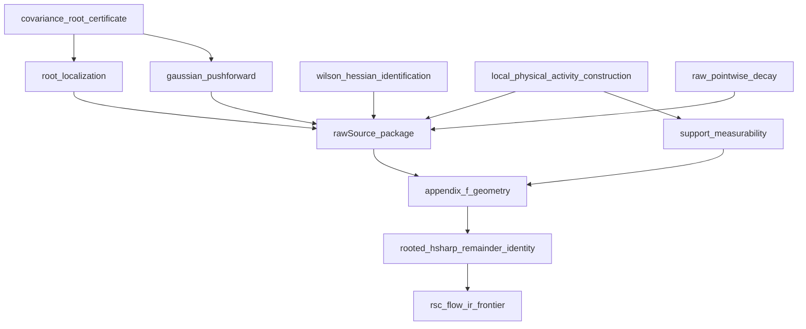

# Raw-source field DAG v6

```mermaid
flowchart TD
  covariance_root_certificate[covariance_root_certificate] --> root_localization[root_localization]
  covariance_root_certificate[covariance_root_certificate] --> gaussian_pushforward[gaussian_pushforward]
  gaussian_pushforward[gaussian_pushforward] --> rawSource_package[rawSource_package]
  root_localization[root_localization] --> rawSource_package[rawSource_package]
  wilson_hessian_identification[wilson_hessian_identification] --> rawSource_package[rawSource_package]
  local_physical_activity_construction[local_physical_activity_construction] --> rawSource_package[rawSource_package]
  local_physical_activity_construction[local_physical_activity_construction] --> support_measurability[support_measurability]
  support_measurability[support_measurability] --> appendix_f_geometry[appendix_f_geometry]
  raw_pointwise_decay[raw_pointwise_decay] --> rawSource_package[rawSource_package]
  rawSource_package[rawSource_package] --> appendix_f_geometry[appendix_f_geometry]
  appendix_f_geometry[appendix_f_geometry] --> rooted_hsharp_remainder_identity[rooted_hsharp_remainder_identity]
  rooted_hsharp_remainder_identity[rooted_hsharp_remainder_identity] --> rsc_flow_ir_frontier[rsc_flow_ir_frontier]
```

Guard: no downstream field can discharge an upstream field.
