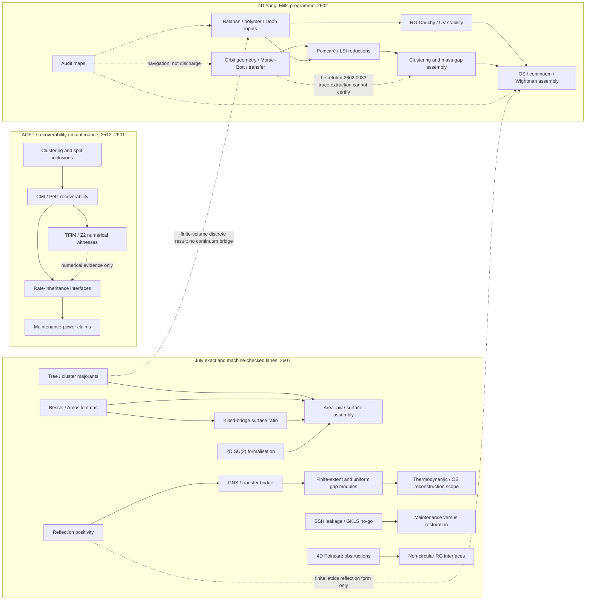

# Claim-dependency graph — public corpus frozen 2026-07-31

The arrows below mean “is used as evidence or an interface by”, not merely “has a
similar topic”. A public paper remains a separate publication unless a claim-level
edge and a supersession decision are both recorded in the supersession matrix.

## Load-bearing claim classes and risk

| Lane | Exact proved content | Machine-certified or numerical content | Conditional/open boundary | Audit priority |
|---|---|---|---|---|
| Orbit-gap / duplication | R30 proves a strengthened abstract exact-trace lemma under finite-scale normalisation, subexponential multiplicity and relative-tail hypotheses. | Finite examples and the positivity-improving counterexample are independently recalculated. | No identification with the intended Yang–Mills transfer operators; `2602.0032v2` still needs the same trace-normalisation sweep. | **P0** for public `2602.0033v2`; replacement package required. |
| Morse–Bott / orbit geometry | Several corrected local geometric statements survive; `2602.0046v3` has a synthetic-curvature, single-scale scope. | SU(2) small-lattice Hessian/quartic checks are numerical. | Public `2602.0035v1` overclaims; public `2602.0052v2` is misassociated with the corrected Morse-Bott PDF even though its authentic v1 is Interface Lemmas; `2602.0036v2` still exposes an O'Neill-trace Ricci proof with omitted mixed terms. No silent equality of quotient measures/operators/gaps. | **P0 REPLACE-VERSION** in causal order 0052, 0036, R30/0033, then 0035. |
| Poincaré / LSI / mass-gap chain | `2602.0040v2` is a conditional Poincaré reduction and `2602.0072v2` contains an unconditional Efron–Stein seminorm bound. | Some finite checks and audit harnesses are reproducibility evidence only. | H-BAL, H-DIS, H-XSD, H-DOB, H-P0, H-YGZ, H-DEC and related interfaces remain hypotheses in the relevant papers. | **P1**, with P0 where downstream prose treats an open supplier as discharged. |
| Continuum / OS / Wightman | Exact finite-lattice or conditional assembly statements may be retained with their hypotheses. | `2602.0117v3` is a 29/29 mechanical audit report, not a proof. | `2602.0063v3` itself records the naive RG-Cauchy rate as non-summable; `2602.0088v3` cites an unpublished H-KP supplier; OS/continuum conclusions remain undischarged. Public `2602.0085v1` has a false Wilson-flow linearisation, and `2602.0084v1` imports it while also containing independent false lemmas. | **P0 REPLACE-VERSION** for 0085 then 0084; **P0 REVIEW-PENDING** for 0063/0088. |
| Area law / cluster / surface theorem | Tree majorants, specific Bessel inequalities and the corrected `2607.0039v1` 2D SU(2) bridge are exact finite statements. | Lean/Arb claims remain paper-reported unless the exact pinned chain is replayed. | `2607.0035v1` omits its original-edge/face-holonomy bridge; `2607.0023v1` leaves the global ratio sign conjectural; `2607.0089v1` awaits independent hybrid replay. | **P0 supersession** for 0035; P1 supersession/review for the surface chain. |
| Reflection positivity / GNS / transfer | The Z2 papers establish explicitly delimited finite-dimensional forms, quotients and kernel facts. | Lean claims cite immutable commits, but this audit did not complete a clean global kernel replay. | Bond/site algebraic positivity is not automatically physical OS reconstruction; the site-identification/GNS and continuum bridges must remain explicit. | **P1** provenance/scope. |
| Thermodynamic and gap modules | Finite-extent strict positivity and certain decoupled uniform moduli are separate exact claims. | Machine-certified status is public-manuscript evidence until replayed. | A finite-extent gap is not a volume-uniform gap; a Gibbs-state thermodynamic limit is not by itself a continuum Yang–Mills construction. | **P1** anti-overclaim boundary. |
| Recoverability / maintenance | Finite-dimensional inequalities and typed conditional interfaces can be kept within scope. | TFIM, IBM and Z2 results are numerical/toy evidence unless otherwise proved. | Static recoverability does not imply a dynamical rate without the stated interface; maintenance is not restoration; `2512.0081v2` is unavailable. | **P0** object integrity for 0081; otherwise P1/P2. |

## Claim-level supersession edges

- `2512.0073v1 -> 2601.0023v2`: the successor corrects the finite-dimensional
  Davies interface and constants used by the same rate-envelope claim.
- `2601.0047v2 -> 2601.0051v2`: the successor retains the exact-diagonalisation
  benchmark and extends the same Petz-versus-Wilson comparison with tensor networks.
- `2607.0035v1 -> 2607.0039v1`: pp. 7 and 9 of the old paper leave open the
  original-edge/face-holonomy bridge that the successor supplies on pp. 5–8.
- `2607.0023v1 -> 2607.0089v1`: the old paper's global ratio-monotonicity step is
  conjectural on pp. 11–13; the successor claims that exact terminal sign theorem.
  The successor itself remains `REVIEW-PENDING` until its Arb/Lean chain is replayed.
- `2602.0033v2 -> local R30`: the old pp. 4–6 exact-trace doubling implication is
  false. R30 withdraws the derivation and states a sufficient finite-scale lemma;
  it does not claim the Yang–Mills hypotheses are discharged.

## Full-corpus coverage map

Every ID below has a row in `PAPER-AUDIT-LEDGER.md`; this index makes the graph's
family assignment explicit.

| Family node | Public IDs covered |
|---|---|
| A1 — clustering/split/AQFT | 2512.0060, 2512.0061, 2512.0064, 2512.0071, 2512.0081, 2512.0084, 2512.0085, 2512.0101, 2601.0007, 2601.0034, 2601.0046, 2601.0065 |
| A2 — CMI/Petz/recoverability geometry | 2601.0035, 2601.0038, 2601.0040, 2601.0042, 2601.0043, 2601.0044, 2601.0047, 2601.0050, 2601.0051, 2601.0099, 2601.0111, 2601.0115 |
| A3/A4 — rate inheritance and maintenance | 2512.0070, 2512.0072, 2512.0073, 2512.0105, 2601.0020, 2601.0022, 2601.0023, 2601.0031, 2601.0064, 2601.0066 |
| Ancillary induced-gravity lane | 2512.0091, 2512.0102 |
| B1 — orbit geometry, spectral reduction and simplified GZ | 2602.0020, 2602.0021, 2602.0032, 2602.0033, 2602.0035, 2602.0036, 2602.0038, 2602.0046, 2602.0052 |
| B2/B4 — Poincaré, LSI, clustering and mass-gap reductions | 2602.0040, 2602.0041, 2602.0051, 2602.0053, 2602.0054, 2602.0055, 2602.0056, 2602.0057, 2602.0088, 2602.0089 |
| B3/B5 — constructive RG and UV stability | 2602.0069, 2602.0070, 2602.0072, 2602.0073, 2602.0077, 2602.0085, 2602.0087, 2602.0091 |
| B6 — reflection, continuum and Wightman assembly | 2602.0063, 2602.0084, 2602.0092 |
| B7 — navigation/audit maps | 2602.0096, 2602.0117 |
| Standalone combinatorics | 2607.0001 |
| C1–C5 — Bessel, cluster, surface and exact 2D SU2 | 2607.0005, 2607.0017, 2607.0018, 2607.0020, 2607.0023, 2607.0025, 2607.0030, 2607.0032, 2607.0033, 2607.0035, 2607.0037, 2607.0039, 2607.0089 |
| C10/C11 — SSH/GKLS maintenance | 2607.0028, 2607.0029, 2607.0031, 2607.0038 |
| C12/C13 — 4D obstruction/interface modules | 2607.0042, 2607.0043, 2607.0044 |
| C6–C9 — Z2 reflection, transfer, gaps and thermodynamic scope | 2607.0070, 2607.0073, 2607.0075, 2607.0076, 2607.0078, 2607.0083, 2607.0084, 2607.0085, 2607.0088, 2607.0090, 2607.0091, 2607.0092, 2607.0093, 2607.0094 |

The map contains 103 distinct IDs. Similarity within a family is not itself a
supersession edge.
