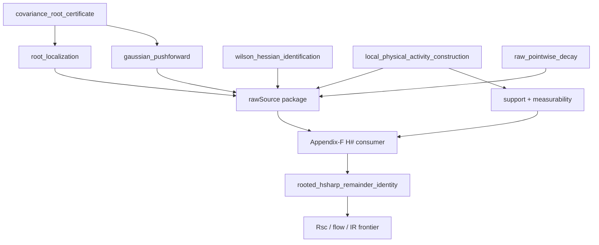

# Raw-source M3 field order — Batch 006

This file is a short guardrail for agents working near `BalabanCMP116SourceTheorem.lean`.

## Correct dependency order

## Review checklist

Before approving a source commit, ask:

1. Which exact field disappears?
2. Which primary source page/equation proves it?
3. Are constants and normalizations carried explicitly?
4. Is Dimock being used only as architecture unless a YM dictionary theorem is supplied?
5. Does the commit avoid backfilling upstream fields from downstream bounds?
